# 🎓 Student Management System

### An AI-Powered Academic Platform

A production-grade, full-stack student management system featuring role-based portals, real-time analytics, and machine learning predictions to identify academically at-risk students. Built with Java, Python, MySQL, and modern web technologies.

**Live Demo:** [students.robertjeanpierre.com](https://students.robertjeanpierre.com) *(coming soon)*
**Portfolio:** [robertjeanpierre.com](https://robertjeanpierre.com)

---

## Screenshots

### Staff Dashboard
Real-time analytics with interactive visualizations — grade distribution, enrollment trends, GPA averages, and student demographics.

| Dark Mode | Light Mode |
|-----------|------------|
| 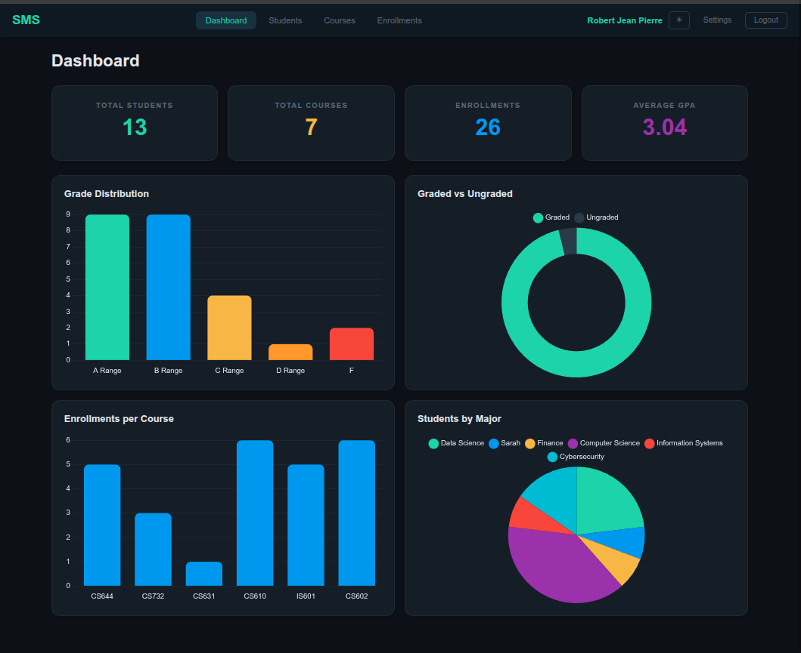 | 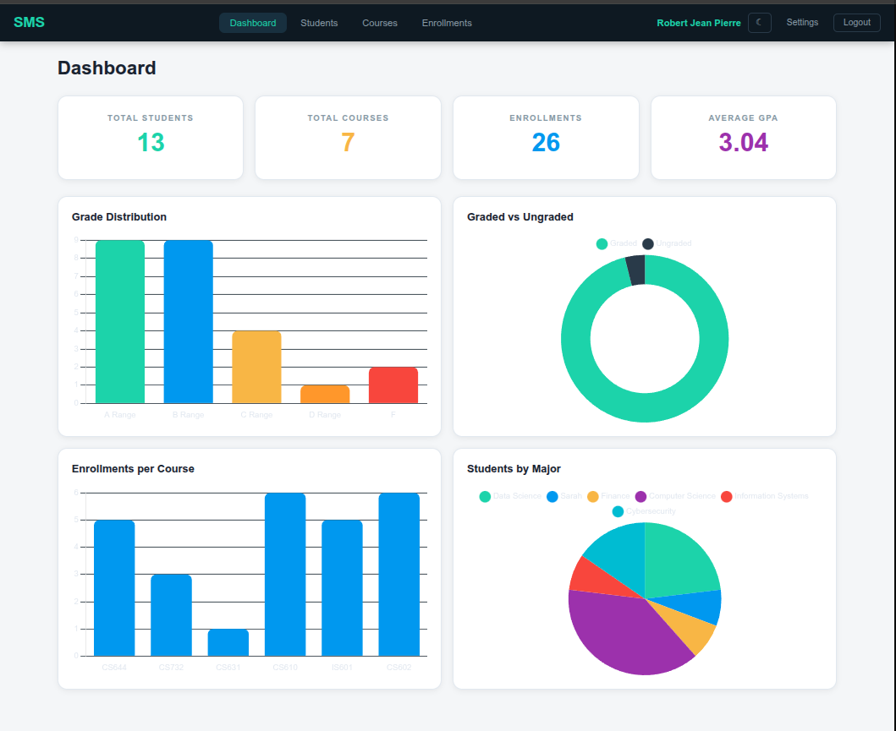 |

### Student Management
Full CRUD operations with auto-generated student IDs, search functionality, ML risk assessment, and admin password reset.

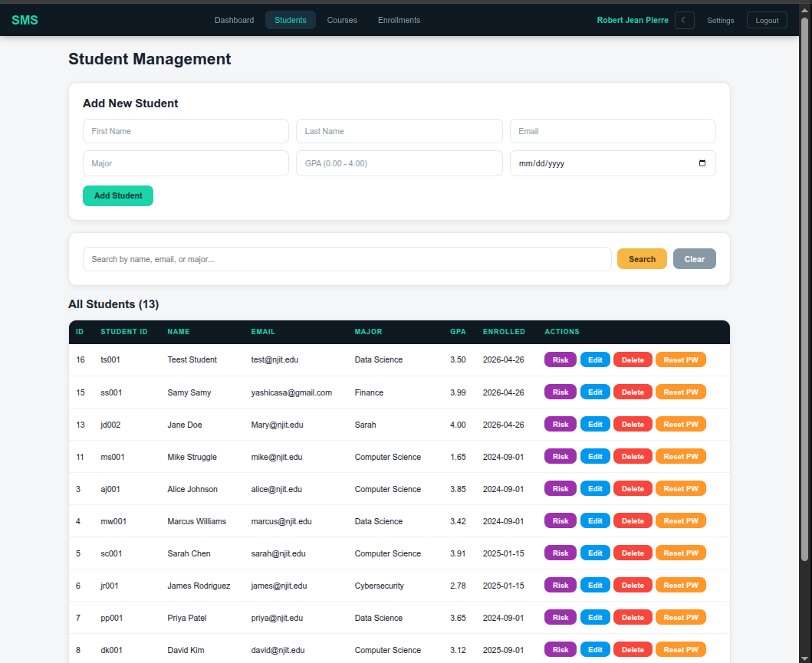

### Enrollment & Grade Tracking
Enroll students in courses, assign letter grades with automatic grade-point conversion, and track academic progress across semesters.

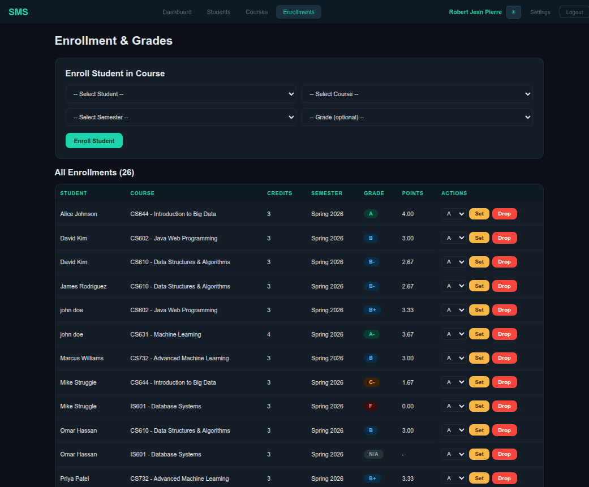

### Student Portal
Students log in with their auto-generated ID and see a personalized dashboard with GPA, enrolled courses, credits, and grades.

| Home | Grades |
|------|--------|
| 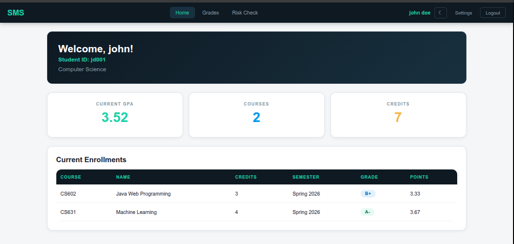 | 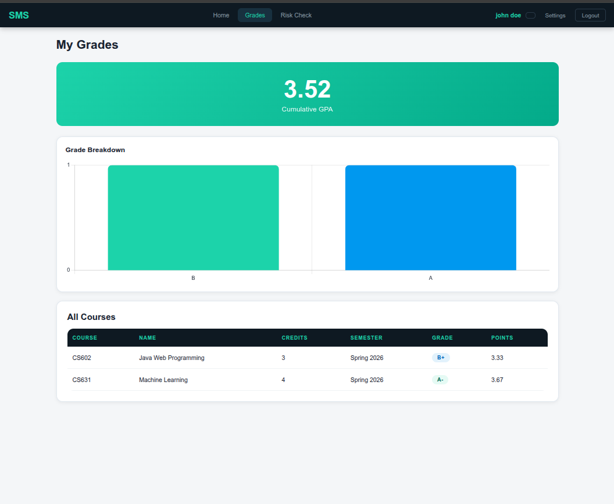 |

### AI Risk Assessment
Machine learning model predicts academic risk with confidence scores and actionable recommendations for both staff and students.

| At Risk | On Track |
|---------|----------|
| 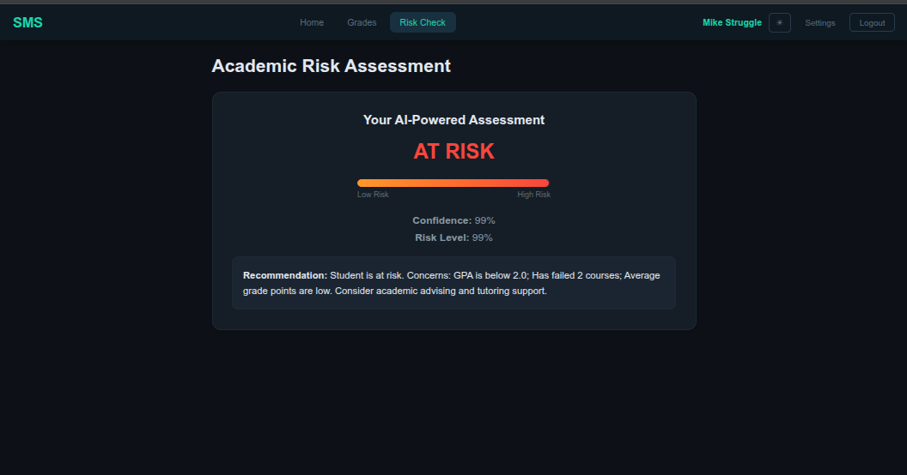 | 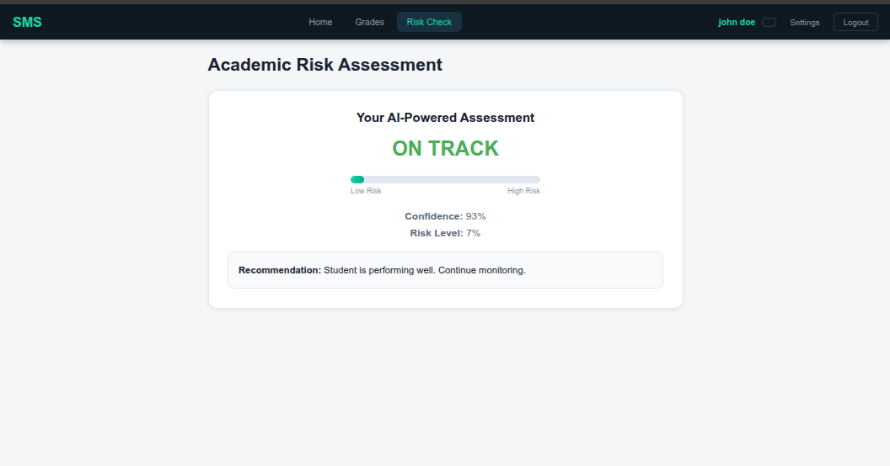 |

### Authentication
Single login page routes users to the correct portal based on their role. Supports dark/light mode with system preference detection.

| Dark | Light |
|------|-------|
| 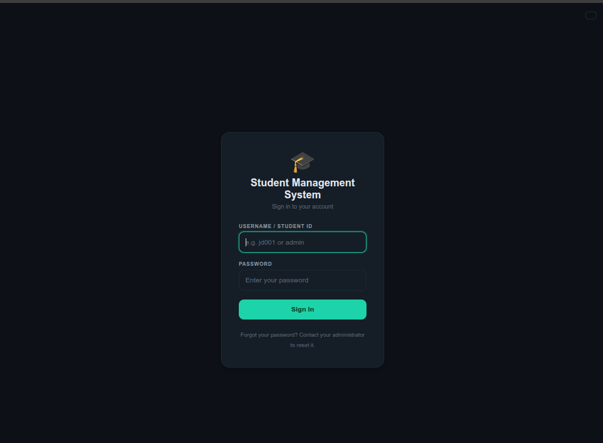 | 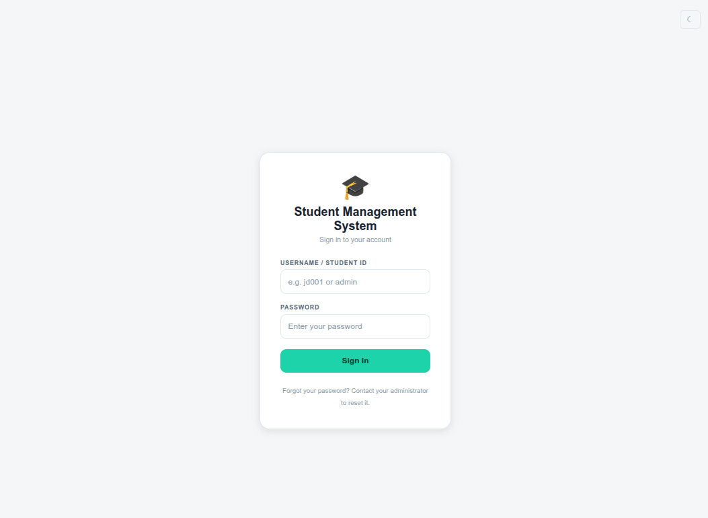 |

### Responsive Design
Every page adapts seamlessly from desktop to tablet to mobile. Tables transform into card-based layouts on smaller screens.

| Mobile Dashboard | Mobile Portal |
|-----------------|---------------|
| 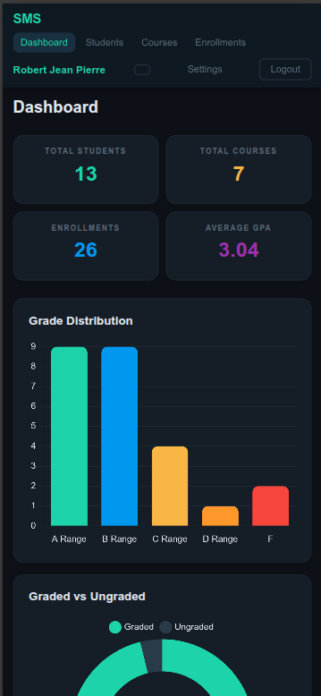 | 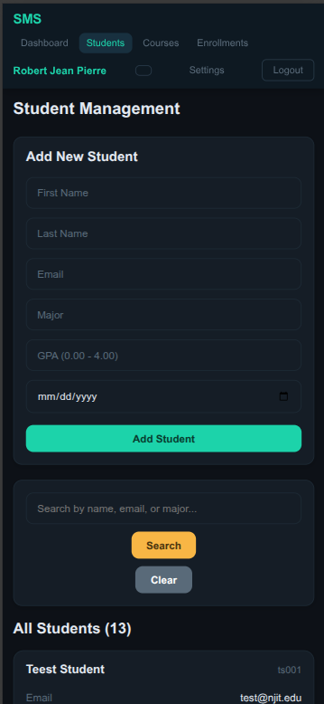 |

---

## Architecture

The system follows a layered MVC architecture with a clear separation of concerns. The Java backend handles business logic and serves both HTML views (via JSP) and JSON data (via REST endpoints). A separate Python Flask microservice handles ML predictions, communicating with the Java backend over HTTP.

```
┌─────────────────────────────────────────────────────────┐
│                      Client Layer                       │
│            Desktop  /  Tablet  /  Mobile                │
│         (Responsive HTML5 + CSS3 + Chart.js)            │
└────────────────┬────────────────────┬───────────────────┘
                 │                    │
                 ▼                    ▼
┌────────────────────────┐  ┌────────────────────────┐
│    Staff Portal        │  │   Student Portal       │
│    /dashboard          │  │   /portal/home         │
│    /students           │  │   /portal/grades       │
│    /courses            │  │   /portal/risk         │
│    /enrollments        │  │                        │
│    /api/*              │  │                        │
└───────────┬────────────┘  └───────────┬────────────┘
            │                           │
            ▼                           ▼
┌─────────────────────────────────────────────────────────┐
│                Authentication Layer                     │
│   AuthFilter (Jakarta Servlet Filter)                   │
│   Role-based routing: ADMIN → Staff, STUDENT → Portal   │
│   Session management with 30-min timeout                │
│   SHA-256 password hashing                              │
└────────────────────────┬────────────────────────────────┘
                         │
                         ▼
┌─────────────────────────────────────────────────────────┐
│               Servlet Layer (Controllers)               │
│  ┌──────────┐ ┌───────────┐ ┌──────────┐ ┌──────────┐   │
│  │Dashboard │ │Student    │ │Course    │ │Enrollment│   │
│  │Servlet   │ │Servlet    │ │Servlet   │ │Servlet   │   │
│  └──────────┘ └───────────┘ └──────────┘ └──────────┘   │
│  ┌──────────┐ ┌───────────┐ ┌──────────┐                │
│  │Portal    │ │Login      │ │API       │                │
│  │Servlet   │ │Servlet    │ │Servlet   │                │
│  └──────────┘ └───────────┘ └──────────┘                │
└────────────────────────┬────────────────────────────────┘
                         │
                         ▼
┌─────────────────────────────────────────────────────────┐
│                  DAO Layer (Data Access)                │
│  ┌───────────┐ ┌───────────┐ ┌──────────────┐           │
│  │StudentDAO │ │CourseDAO  │ │EnrollmentDAO │           │
│  └───────────┘ └───────────┘ └──────────────┘           │
│  ┌───────────┐                                          │
│  │UserDAO    │  (JDBC + PreparedStatements)             │
│  └───────────┘  (SQL Injection Prevention)              │
└──────────┬──────────────────────────┬───────────────────┘
           │                          │
           ▼                          ▼
┌──────────────────────┐  ┌──────────────────────────┐
│    MySQL 8.0         │  │   Flask ML Microservice  │
│                      │  │   (Python 3.12)          │
│  5 relational tables │  │                          │
│  with foreign keys,  │  │   Random Forest Model    │
│  cascading deletes,  │  │   96% accuracy           │
│  and unique          │  │                          │
│  constraints         │  │   POST /predict          │
│                      │  │   GET  /health           │
└──────────────────────┘  └──────────────────────────┘
```

---

## Database Design

The database uses 5 normalized tables with enforced referential integrity through foreign keys and cascading operations.

```sql
-- Core academic data
students    (id, user_id FK, student_id, first_name, last_name, email, major, gpa, enrollment_date)
courses     (id, course_code UNIQUE, course_name, credits, description)
enrollments (id, student_id FK, course_id FK, semester, grade, grade_points)
            -- UNIQUE constraint on (student_id, course_id, semester)
            -- ON DELETE CASCADE from both students and courses

-- Authentication & authorization
users       (id, username UNIQUE, password_hash, role ENUM, is_active, last_login)
staff       (id, user_id FK, first_name, last_name, email, department, title)
```

**Key design decisions:**
- `enrollments` serves as a junction table implementing a many-to-many relationship between students and courses, with semester as an additional discriminator
- `ON DELETE CASCADE` ensures data integrity — deleting a student automatically removes their enrollments
- `grade_points` stores the numeric equivalent (A=4.0, B+=3.33, etc.) for efficient GPA calculation using weighted averages: `SUM(grade_points × credits) / SUM(credits)`
- Student authentication is linked through `users.id → students.user_id`, keeping credentials separate from academic data

---

## Machine Learning Deep Dive

### The Problem
Universities often identify at-risk students too late — after they've already failed courses or dropped out. Early intervention requires predictive signals that human advisors might miss across hundreds of students.

### The Approach
I built a supervised classification model using a Random Forest ensemble to predict whether a student is academically at-risk based on their academic performance metrics.

**Why Random Forest?**
- Handles non-linear relationships between features (e.g., a student with 3.5 GPA but 3 failed courses is still at risk)
- Provides feature importance rankings, making predictions interpretable for advisors
- Robust against overfitting with 100 decision trees (estimators)
- No feature scaling required — works directly with raw GPA and count values

### Training Data
Generated 500 synthetic student profiles with realistic distributions modeled after actual university patterns:

| Feature | Range | Distribution |
|---------|-------|-------------|
| GPA | 0.5 – 4.0 | Uniform |
| Courses taken | 1 – 12 | Uniform integer |
| Courses failed | 0 – 5 | Uniform integer |
| Avg grade points | 0.5 – 4.0 | Uniform |
| Credits completed | 3 – 60 | Uniform integer |
| Semesters enrolled | 1 – 8 | Uniform integer |

**Labeling criteria** (a student is "at risk" if any of these apply):
- GPA below 2.0
- 3 or more courses failed
- Average grade points below 1.5
- GPA below 2.5 AND 2+ courses failed
- Fewer than 15 credits completed after 4+ semesters

### Results

```
              precision    recall  f1-score   support

 Not At Risk       0.88      0.88      0.88        17
     At Risk       0.98      0.98      0.98        83

    accuracy                           0.96       100
```

**Feature Importance:**

| Feature | Importance | Interpretation |
|---------|-----------|----------------|
| GPA | 33.96% | Strongest single predictor of academic success |
| Courses failed | 26.32% | Direct indicator of academic difficulty |
| Avg grade points | 20.94% | Captures grade trajectory beyond cumulative GPA |
| Credits completed | 8.49% | Progress indicator — slow progress signals risk |
| Courses taken | 5.21% | Course load context |
| Semesters enrolled | 5.07% | Time-in-program context |

### Integration Architecture
The ML model runs as an independent Flask microservice, decoupled from the Java backend:

1. **Staff clicks "Risk Check"** on a student in the Java web app
2. **StudentServlet** gathers the student's academic metrics from the database (GPA, enrollment count, failed courses, etc.)
3. **MLClient utility class** sends an HTTP POST request to `http://localhost:5000/predict` with the metrics as JSON
4. **Flask API** loads the pre-trained model from disk (`student_risk_model.pkl`), runs inference, and returns a JSON response with the prediction, confidence score, and a human-readable recommendation
5. **JSP renders** the result with color-coded risk status, confidence percentage, risk probability meter, and specific concerns

This microservice architecture means the ML model can be retrained, updated, or replaced without touching the Java codebase — a production-ready pattern used in industry.

### Future ML Enhancements
- Train on real anonymized university data for higher accuracy
- Add time-series features (GPA trend over semesters, grade improvement/decline)
- Implement model versioning and A/B testing
- Add batch prediction for end-of-semester risk reports
- Explore gradient boosting (XGBoost) for potential accuracy improvements

---

## Security Implementation

### Authentication Flow
1. User submits credentials at `/login`
2. `UserDAO.authenticate()` hashes the submitted password with SHA-256 and compares against the stored hash
3. On success, a server-side `HttpSession` is created with user object and display name
4. `AuthFilter` (Jakarta Servlet Filter mapped to `/*`) intercepts every request:
   - Public resources (login, CSS, JS, API) pass through
   - Unauthenticated requests redirect to login
   - Students accessing staff URLs redirect to student portal
   - Staff accessing student URLs redirect to dashboard
5. Sessions expire after 30 minutes of inactivity

### Student ID Generation
Student IDs follow a deterministic format: `[first initial][last initial][3-digit sequence]`

The `UserDAO.generateStudentId()` method:
1. Computes the 2-character prefix from the student's name
2. Queries the database for the highest existing ID with that prefix
3. Increments by 1 and zero-pads to 3 digits
4. Guarantees uniqueness even for students with identical initials (e.g., `rj001`, `rj002`)

---

## Challenges & Solutions

### 1. Cross-Language ML Integration
**Challenge:** Connecting a Python ML model to a Java web application without tightly coupling the two systems.

**Solution:** Built the ML component as an independent Flask microservice with a clean REST API (`/predict`, `/health`). The Java backend communicates via HTTP POST using a dedicated `MLClient` utility class with timeout handling and error recovery. If the Flask service is unavailable, the app degrades gracefully — showing "service unavailable" instead of crashing.

**What I learned:** Microservice architecture patterns, cross-language API design, and the importance of graceful degradation in distributed systems.

### 2. Servlet Filter Redirect Loops
**Challenge:** Implementing role-based access control with a servlet filter caused infinite redirect loops. Students logging in would bounce between `/portal/home` and `/login` indefinitely because the filter, login servlet, and portal servlet were redirecting to each other.

**Solution:** Systematic debugging with console logging in the filter to trace every request path and user state. Discovered two root causes: (1) the `PortalServlet` mapped to `/portal/*` was intercepting its own JSP forwards, and (2) the `StudentDAO` wasn't reading the `user_id` column, so the student record lookup always failed. Fixed by switching to explicit URL mappings (`/portal/home`, `/portal/grades`, `/portal/risk`) and ensuring all DAO methods read the new database columns.

**What I learned:** The importance of understanding the servlet lifecycle, the difference between `forward` and `redirect`, and how filter chains interact with servlet mappings. Debugging distributed request flows requires systematic tracing, not guesswork.

### 3. CUDA/TensorFlow GPU Compatibility
**Challenge:** TensorFlow couldn't detect the NVIDIA RTX 4090 GPU despite CUDA 13.0 being installed. The pip-installed TensorFlow was built against CUDA 12.x, and the bundled CUDA libraries weren't on the system library path.

**Solution:** Installed TensorFlow with `pip install tensorflow[and-cuda]` to bundle compatible CUDA 12 libraries, then traced the exact missing library (`libcudart.so.12`) using `ctypes` in Python. Added all NVIDIA pip package library paths to `LD_LIBRARY_PATH` and persisted the configuration in the virtualenv's activate script.

**What I learned:** GPU computing environments require careful version alignment across drivers, CUDA toolkit, cuDNN, and framework-specific builds. The solution isn't always installing the latest — it's matching compatible versions across the stack.

### 4. Database Schema Evolution
**Challenge:** Adding authentication (users table, student IDs) to an existing database with live data required careful schema migration without breaking existing functionality.

**Solution:** Used `ALTER TABLE` to add `user_id` and `student_id` columns to the students table, then wrote SQL scripts to retroactively generate student IDs and create user accounts for all existing students. Updated all DAO methods to read the new columns — a missed column in `getAllStudents()` caused a subtle bug where student-user matching silently failed.

**What I learned:** Schema migrations in production require updating every query that touches the modified table, not just the ones you think are affected. A single missed column read can cascade into auth failures that are difficult to diagnose.

### 5. Centralized Theming Across JSP Pages
**Challenge:** Initially, each JSP page had its own inline `<style>` block with hundreds of lines of CSS. Adding dark mode meant duplicating theme logic across 10+ files — a maintenance nightmare.

**Solution:** Extracted all styles into a single `theme.css` file using CSS custom properties (variables) for every color, shadow, and border. Created a `theme.js` script that detects system preference, supports manual toggle, and persists the choice in `localStorage`. Every JSP page references the same two files — changing a color in one place updates the entire application instantly.

**What I learned:** CSS architecture matters. Custom properties aren't just syntactic sugar — they enable runtime theming that would be impossible with static values. This is the same pattern used by design systems at companies like GitHub and Stripe.

---

## Tech Stack

| Layer | Technology | Purpose |
|-------|-----------|---------|
| **Backend** | Java 21, Jakarta EE 6 | Server-side logic, request handling |
| **Web Server** | Apache Tomcat 10.1 | Servlet container |
| **Database** | MySQL 8.0 | Relational data storage with ACID transactions |
| **ML Runtime** | Python 3.12, scikit-learn | Model training and inference |
| **ML API** | Flask | REST microservice for predictions |
| **Frontend** | HTML5, CSS3, JavaScript | Responsive UI |
| **Charts** | Chart.js | Interactive data visualizations |
| **View Engine** | JSP + JSTL | Server-side rendering with tag libraries |
| **Build** | Apache Maven | Dependency management, WAR packaging |
| **Version Control** | Git + GitHub | Source control |
| **GPU** | NVIDIA RTX 4090, CUDA 13.0 | Model training acceleration |

---

## REST API

The system exposes JSON endpoints for programmatic access and future frontend integration (React, mobile apps):

| Endpoint | Method | Description | Example Response |
|----------|--------|-------------|-----------------|
| `/api/students` | GET | All students with calculated GPAs | `[{"id":3, "firstName":"Alice", "gpa":3.89}]` |
| `/api/courses` | GET | All courses | `[{"courseCode":"CS602", "credits":3}]` |
| `/api/enrollments` | GET | All enrollments with joined data | `[{"studentName":"Alice Johnson", "grade":"A"}]` |
| `/api/stats` | GET | Dashboard statistics | `{"totalStudents":13, "avgGpa":3.04}` |

---

## 🆔 Student ID System

IDs are auto-generated when staff adds a new student:

```
Format: [first initial][last initial][3-digit sequence]

Robert Jean Pierre  → rj001
Alice Johnson       → aj001
Another RJ student  → rj002  (auto-incremented)
```

The system queries the database for the highest existing sequence with matching initials and increments by 1, ensuring uniqueness without collisions.

---

## Setup & Installation

### Prerequisites
- Java 21+
- Apache Tomcat 10+
- MySQL 8.0+
- Python 3.10+ with pip
- Maven

### 1. Clone the repository
```bash
git clone https://github.com/rpmjp/student-management-system.git
cd student-management-system
```

### 2. Set up MySQL database
```bash
mysql -u root -p
```
```sql
CREATE DATABASE student_management;
USE student_management;

CREATE TABLE students (
    id INT AUTO_INCREMENT PRIMARY KEY,
    user_id INT UNIQUE,
    student_id VARCHAR(20) UNIQUE,
    first_name VARCHAR(50) NOT NULL,
    last_name VARCHAR(50) NOT NULL,
    email VARCHAR(100) NOT NULL UNIQUE,
    major VARCHAR(100),
    gpa DECIMAL(3,2),
    enrollment_date DATE,
    created_at TIMESTAMP DEFAULT CURRENT_TIMESTAMP
);

CREATE TABLE courses (
    id INT AUTO_INCREMENT PRIMARY KEY,
    course_code VARCHAR(20) NOT NULL UNIQUE,
    course_name VARCHAR(100) NOT NULL,
    credits INT NOT NULL,
    description TEXT,
    created_at TIMESTAMP DEFAULT CURRENT_TIMESTAMP
);

CREATE TABLE enrollments (
    id INT AUTO_INCREMENT PRIMARY KEY,
    student_id INT NOT NULL,
    course_id INT NOT NULL,
    semester VARCHAR(20) NOT NULL,
    grade VARCHAR(2),
    grade_points DECIMAL(3,2),
    enrolled_at TIMESTAMP DEFAULT CURRENT_TIMESTAMP,
    FOREIGN KEY (student_id) REFERENCES students(id) ON DELETE CASCADE,
    FOREIGN KEY (course_id) REFERENCES courses(id) ON DELETE CASCADE,
    UNIQUE KEY unique_enrollment (student_id, course_id, semester)
);

CREATE TABLE users (
    id INT AUTO_INCREMENT PRIMARY KEY,
    username VARCHAR(50) NOT NULL UNIQUE,
    password_hash VARCHAR(255) NOT NULL,
    role ENUM('ADMIN', 'STAFF', 'STUDENT') NOT NULL,
    is_active BOOLEAN DEFAULT TRUE,
    last_login TIMESTAMP NULL,
    created_at TIMESTAMP DEFAULT CURRENT_TIMESTAMP
);

CREATE TABLE staff (
    id INT AUTO_INCREMENT PRIMARY KEY,
    user_id INT NOT NULL UNIQUE,
    first_name VARCHAR(50) NOT NULL,
    last_name VARCHAR(50) NOT NULL,
    email VARCHAR(100) NOT NULL UNIQUE,
    department VARCHAR(100),
    title VARCHAR(100),
    created_at TIMESTAMP DEFAULT CURRENT_TIMESTAMP,
    FOREIGN KEY (user_id) REFERENCES users(id) ON DELETE CASCADE
);

ALTER TABLE students ADD FOREIGN KEY (user_id) REFERENCES users(id) ON DELETE SET NULL;
```

### 3. Create admin account
```sql
INSERT INTO users (username, password_hash, role) VALUES
('admin', SHA2('Admin123!', 256), 'ADMIN');

INSERT INTO staff (user_id, first_name, last_name, email, department, title) VALUES
(LAST_INSERT_ID(), 'Admin', 'User', 'admin@school.edu', 'IT', 'System Administrator');
```

### 4. Configure database connection
Edit `src/main/java/com/robertjp/util/DBConnection.java`:
```java
private static final String URL = "jdbc:mysql://localhost:3306/student_management";
private static final String USER = "root";
private static final String PASSWORD = "your_password_here";
```

### 5. Build and deploy
```bash
mvn clean package
cp target/StudentManagementSystem.war /path/to/tomcat/webapps/
```

### 6. Set up ML predictor
```bash
cd ml-predictor
python -m venv venv
source venv/bin/activate
pip install flask scikit-learn pandas numpy
python train_model.py
python app.py
```

### 7. Access the application
| URL | Purpose |
|-----|---------|
| `http://localhost:8080/StudentManagementSystem` | Web application |
| `http://localhost:5000/health` | ML API health check |
| Admin login: `admin` / `Admin123!` | Staff portal access |

---

## 📁 Project Structure

```
StudentManagementSystem/
├── src/main/
│   ├── java/com/robertjp/
│   │   ├── dao/                    # Data Access Objects
│   │   │   ├── StudentDAO.java     #   Student CRUD + search
│   │   │   ├── CourseDAO.java      #   Course CRUD
│   │   │   ├── EnrollmentDAO.java  #   Enrollments + GPA calc + JOINs
│   │   │   └── UserDAO.java        #   Auth + student ID generation
│   │   ├── model/                  # Domain objects
│   │   │   ├── Student.java
│   │   │   ├── Course.java
│   │   │   ├── Enrollment.java
│   │   │   └── User.java
│   │   ├── servlet/                # HTTP controllers
│   │   │   ├── DashboardServlet.java
│   │   │   ├── StudentServlet.java
│   │   │   ├── CourseServlet.java
│   │   │   ├── EnrollmentServlet.java
│   │   │   ├── PortalServlet.java
│   │   │   ├── LoginServlet.java
│   │   │   ├── PasswordServlet.java
│   │   │   └── ApiServlet.java
│   │   └── util/                   # Infrastructure
│   │       ├── AuthFilter.java     #   Role-based access control
│   │       ├── DBConnection.java   #   JDBC connection manager
│   │       └── MLClient.java       #   HTTP client for Flask API
│   └── webapp/
│       ├── css/
│       │   ├── theme.css           # Centralized design system
│       │   └── theme.js            # Dark/light mode controller
│       ├── portal/                 # Student portal views
│       │   ├── home.jsp
│       │   ├── grades.jsp
│       │   └── risk.jsp
│       ├── WEB-INF/web.xml         # Servlet config, error pages
│       ├── dashboard.jsp
│       ├── students.jsp
│       ├── courses.jsp
│       ├── enrollments.jsp
│       ├── login.jsp
│       ├── change-password.jsp
│       ├── error-404.jsp
│       └── error-500.jsp
├── ml-predictor/
│   ├── train_model.py              # Model training pipeline
│   ├── app.py                      # Flask REST API
│   └── model/
│       └── student_risk_model.pkl  # Serialized trained model
├── screenshots/                    # App screenshots for README
├── pom.xml                         # Maven dependencies
└── README.md
```

---

## Key Metrics

| Metric | Value |
|--------|-------|
| Java source files | 12 |
| JSP view files | 11 |
| Database tables | 5 |
| REST API endpoints | 4 |
| ML model accuracy | 96% |
| Responsive breakpoints | 3 (desktop, tablet, mobile) |
| Theme modes | 2 (dark + light) |
| User roles | 3 (admin, staff, student) |

---

## Roadmap

- [ ] Docker containerization (Java + MySQL + Flask)
- [ ] Cloud deployment (AWS / Railway)
- [ ] React frontend rebuild for SPA experience
- [ ] React Native mobile app
- [ ] Electron desktop app
- [ ] Real-time notifications (WebSocket)
- [ ] Email notifications for grade updates
- [ ] CSV/PDF report export
- [ ] Activity audit logging
- [ ] Model retraining pipeline with real data

---

## 👨‍💻 Built By

**Robert Jean Pierre**
Computer Science M.S. Candidate — NJIT (3.9 GPA)
Specializing in Machine Learning, Deep Learning, and Full-Stack Development

-  [robertjeanpierre.com](https://robertjeanpierre.com)
-  [github.com/rpmjp](https://github.com/rpmjp)
-  [linkedin.com/in/rpmjp](https://linkedin.com/in/rpmjp)

---

## License

This project is open source and available under the [MIT License](LICENSE).
